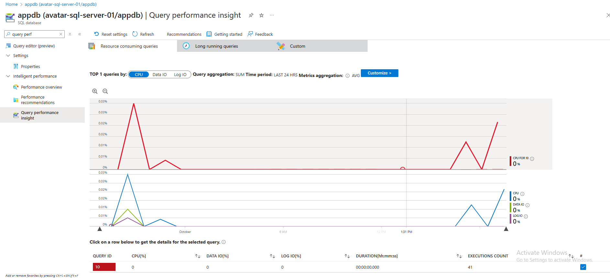
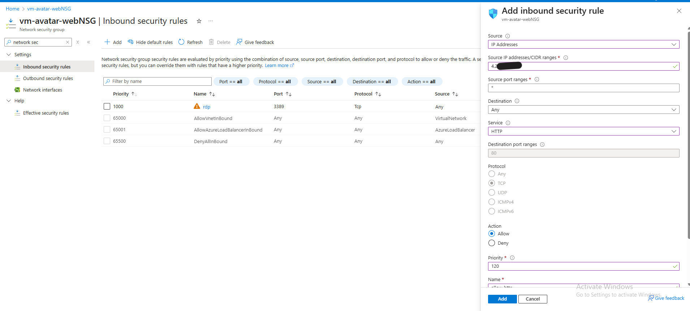
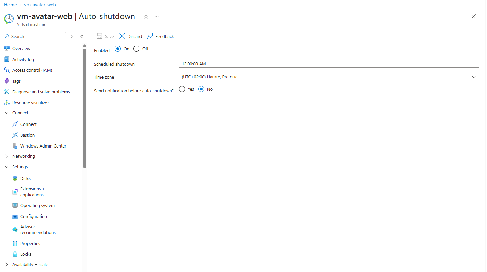

# Monitoring, Security & Cost Optimization — Avatar Cloud Demo

This document covers Phase 8 enhancements.

## 1. Monitoring
- Enabled Diagnostic Settings on SQL Database:
  - Logs: SQLInsights, Errors, QueryStoreRuntimeStatistics, QueryStoreWaitStatistics
  - Metrics: AllMetrics
- Destination: Log Analytics workspace `la-avatar-demo`
- Used Query Performance Insight to identify top queries by CPU and duration.

## 2. Security
- SQL firewall scoped to VM IP + workstation IP
- Disabled “Allow Azure services” for tighter control
- VM NSG inbound rules:
  - HTTP (80/8080) open
  

  - RDP (3389) restricted to my IP
- IIS bindings cleaned to avoid duplicate `*:80`
- Secrets stored in `web.config` (masked in repo)

## 3. Cost Optimization
- VM auto-shutdown enabled at 12:00 SAST

- VM deallocated when idle to avoid charges
- SQL tier scaled to Basic/S0 for demo workloads
- Log Analytics retention set to 30 days

## 4. Validation
- Verified logs flowing into Log Analytics
- Confirmed top queries visible in Query Performance Insight
- Tested RDP/HTTP access rules
- Checked cost analysis blade for reduced spend
