# Setup Guide — Avatar Cloud Demo

This guide explains how to deploy the Avatar Cloud Demo: an IIS-hosted ASP.NET app connected to Azure SQL Database.

## 1. Prerequisites
- Azure subscription (South Africa North region)
- Resource group: `rg-my-avatar-spoke`

- Log Analytics workspace: `la-avatar-demo`
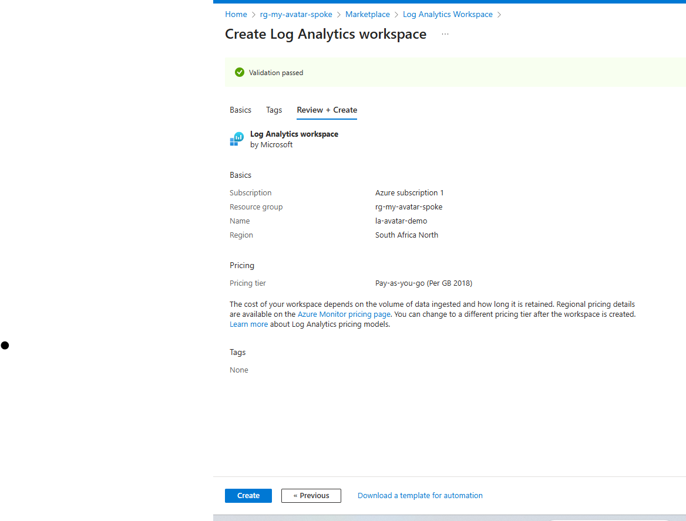
- Visual Studio Code / PowerShell / Azure CLI

## 2. Deploy Infrastructure
1. Create a Windows Server VM 
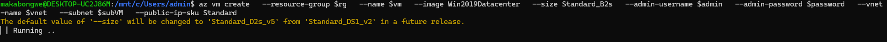
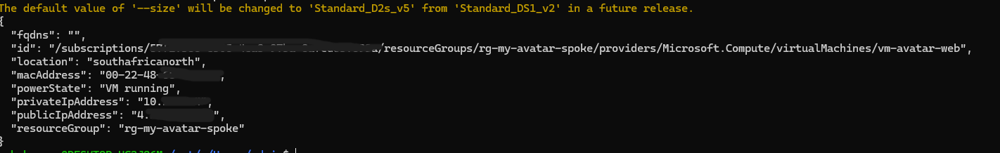

   - Size: Standard B2s (demo-friendly)
   - NSG: Allow HTTP (80/8080) + RDP (3389, restricted to your IP)
   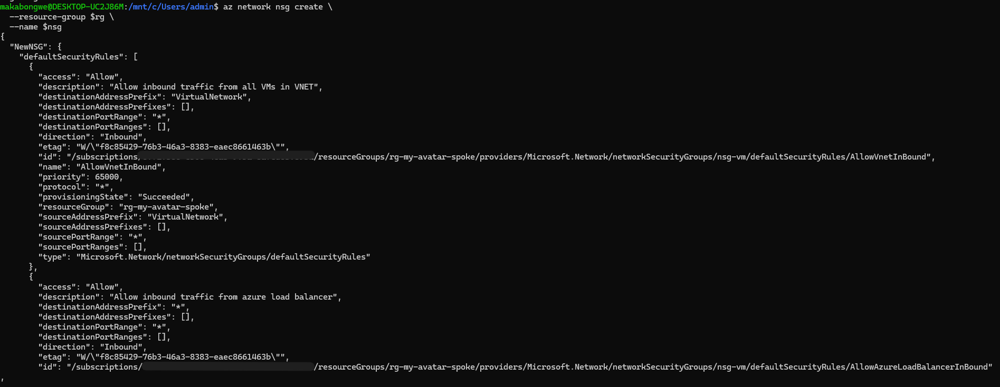
   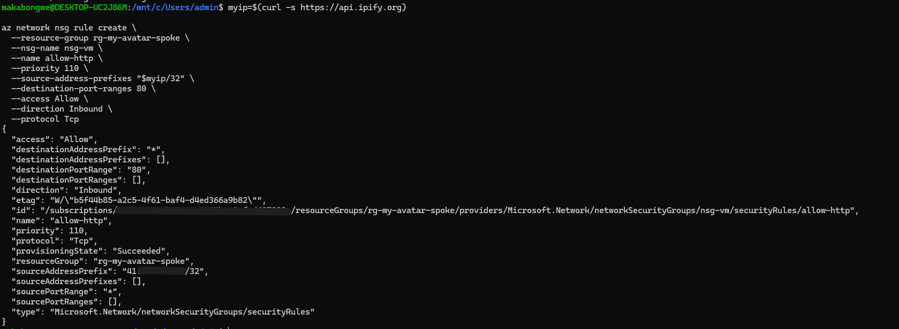
   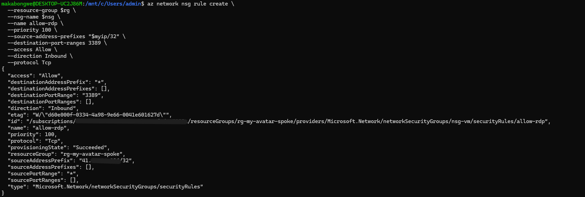

2. Create Azure SQL Database
   - Server: `avatar-sql-server-01`
   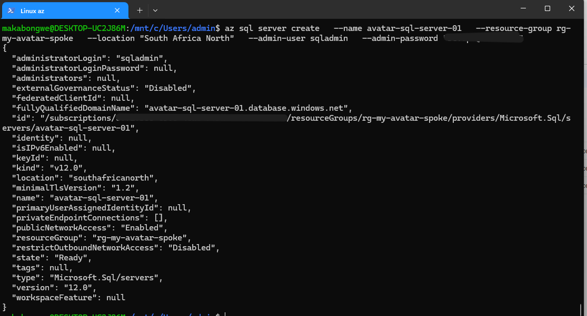
   - Database: `appdb`
   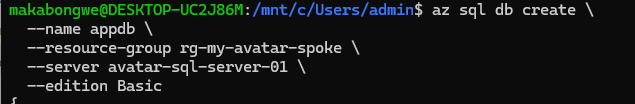
   - Tier: Basic/S0 (demo-friendly)

3. Configure Networking
   - SQL firewall: allow VM public IP + your workstation IP
   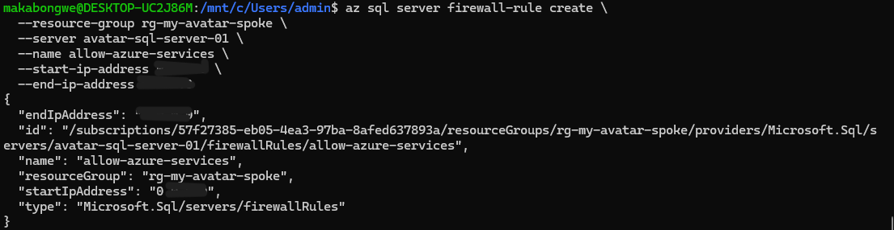
   - Disable “Allow Azure services” unless required
   

## 3. Configure IIS + App 
1. Install IIS + ASP.NET features on the VM

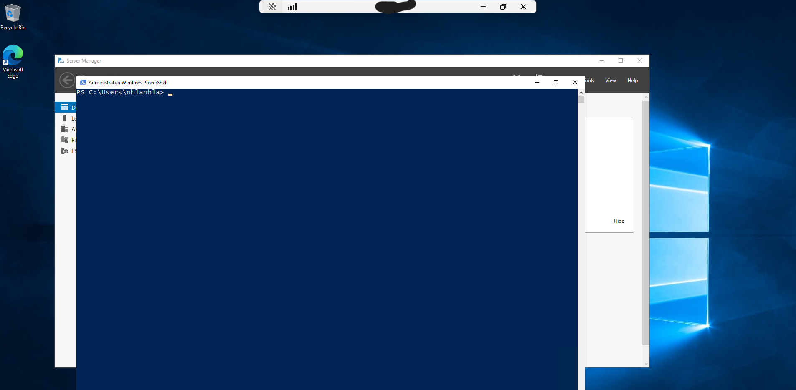
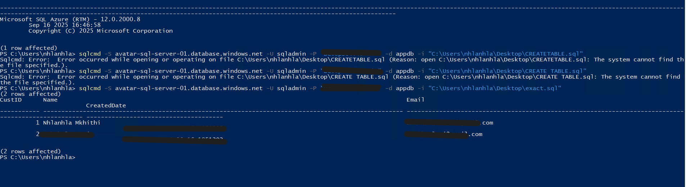
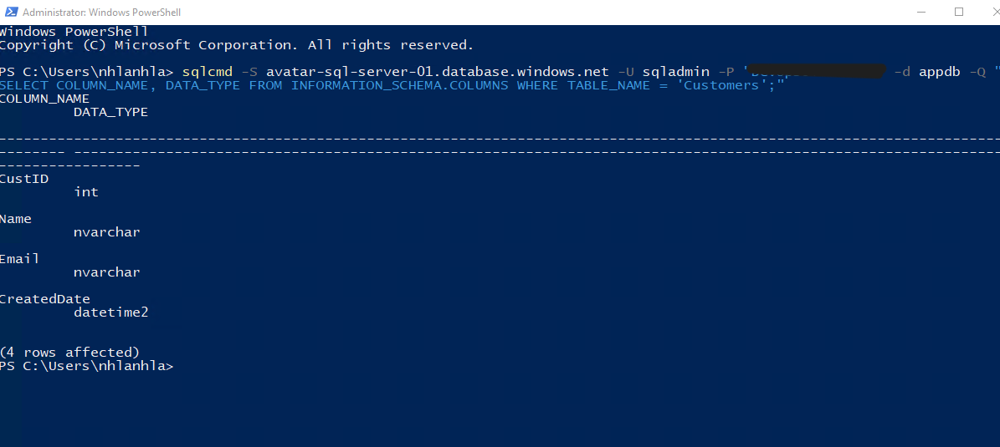
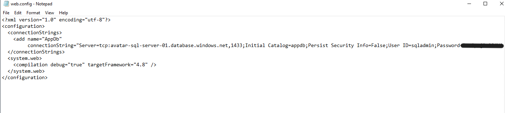
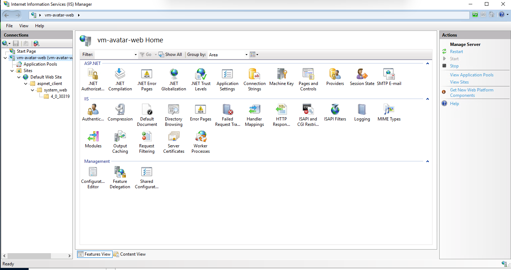

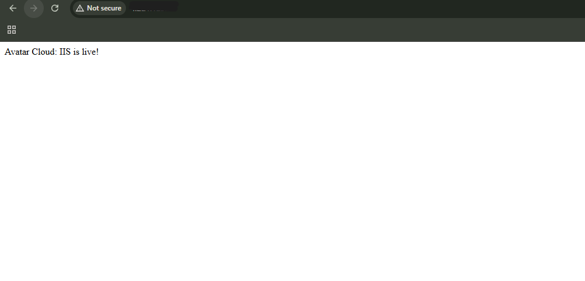

   
